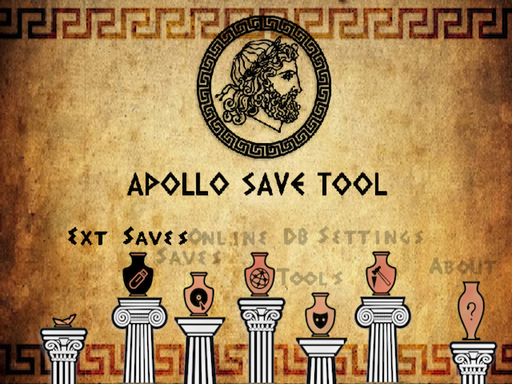

# Apollo Save Tool (PS2)

[![Downloads][img_downloads]][app_downloads] [![Release][img_latest]][app_latest] [![License][img_license]][app_license]

**Apollo Save Tool** is an application to manage save-game files on the PlayStation 2.

This homebrew app allows you to download, unlock, patch and resign save-game files directly on your PS2.

**Comments, ideas, suggestions?** You can [contact me](https://github.com/bucanero/) on [Twitter](https://twitter.com/dparrino) and on [my website](http://www.bucanero.com.ar/).

# Features

* **Easy to use:** no advanced setup needed.
* **Standalone:** no computer required, everything happens on the PS2.
* **Automatic settings:** auto-detection of User settings.

## Save Management

* **Save files listing:** quick access to all the save files on Memory Cards and external devices (+ file details)
* **Save files patching:** complete support for Save Wizard and [Bruteforce Save Data](https://bruteforcesavedata.forumms.net/) cheat patches to enhance your save-games.
* **Save import/export:** allows the user export save files to `.PSU`, `.PSV`, `.CBS` formats, and import saves from other tools and consoles (`.PSU`, `.PSV`, `.CBS`, `.MAX`, `.XPS`, `.SPS` supported).
<!--
* **Save downloading:** easy access to an Online Database of save-game files to download straight to your PS2.
-->

## Virtual Memory Card (VMC) Management

* **VMC saves listing:** quick access to all save files on Virtual Memory Cards images (+ file details)
* **VMC saves import/export:** allows the user export saves on VMC images to `.PSU`, `.PSV` formats, and import saves to VMCs from other tools and consoles (`.PSU`, `.PSV` supported).

# Download

Get the [latest version here][app_latest].

## Changelog

See the [latest changes here][changelog].

# Donations

My GitHub projects are open to a [sponsor program](https://patreon.com/dparrino). If you feel that my tools helped you in some way or you would like to support it, you can consider a [PayPal donation](https://www.paypal.me/bucanerodev).

# Setup instructions

No special setup is needed. Just download the latest `apollo-ps2.zip` package and install `APOLLO.ELF` on your PlayStation 2.
On first run, the application will detect and setup the required user settings.

## Data folders

### PS2

| PS2 | Folder |
|-----|--------|
| **External saves** | your saves must be stored on `<mass/host/cdfs>:/PS2/SAVEDATA/`. |
| **Memory Card saves** | save-games will be scanned from `mc0:/` and `mc1:/`. |
| **Virtual Memory Cards** | VMC images will be scanned from `<mass/host>:/VMC/` and `/PS2/VMC/`. |

# Usage

Using the application is simple and straight-forward: 

 - Move <kbd>UP</kbd>/<kbd>DOWN</kbd> to select the save-game file you want to patch, and press . The patch screen will show the available fixes for the file. Select the patches and click `Apply`.
 - To view the item's details, press .
It will open the context menu on the screen. Press  to return to the list.
 - To reload the list, press .
 - Press <kbd>L1</kbd>/<kbd>L2</kbd> or <kbd>R1</kbd>/<kbd>R2</kbd> trigger buttons to move pages up or down.

<!--
# Online Database

The application also provides direct access to the [Apollo online database](https://github.com/bucanero/apollo-saves) of save-game files for PlayStation Portable games.
These usually offer additional features such as completed games that can save you many hours of playing.

The Online Database project aims to [add more save-games](https://github.com/bucanero/apollo-saves/issues/new/choose) shared by the community.
-->

# FAQs

 1. Where I can get a save-game for *XYZ game*?
    
    You can check sites like [Brewology.com](https://ps3.brewology.com/gamesaves/savedgames.php?page=savedgames&system=psp), and [GameFAQs](https://gamefaqs.gamespot.com/psp/). Also, searching on [Google](http://www.google.com) might help.
 1. I have a save-game file that I want to share. How can I upload it?
    
    If you have a save file that is not currently available on the Online Database and want to share it, please check [this link](https://github.com/bucanero/apollo-saves) for instructions.
 1. Why is it called **Apollo**?
    
    [Apollo](https://en.wikipedia.org/wiki/Apollo) was the twin brother of [Artemis](https://en.wikipedia.org/wiki/Artemis), goddess of the hunt. Since this project was born using the [Artemis-GUI](https://github.com/Dnawrkshp/ArtemisPS3/) codebase, I decided to respect that heritage by calling it Apollo.

# Credits

* [Bucanero](http://www.bucanero.com.ar/): [Project developer](https://github.com/bucanero)

## Acknowledgments

* [Dnawrkshp](https://github.com/Dnawrkshp/): [Artemis PS3](https://github.com/Dnawrkshp/ArtemisPS3)
* [Berion](https://www.psx-place.com/members/berion.1431/): GUI design
* [jimmikaelkael](https://github.com/jimmikaelkael): ps3mca tool
* [aldostools](https://aldostools.org/): [Bruteforce Save Data](https://bruteforcesavedata.forumms.net/)
* [PiNk/abyss](http://amigascne.org/abyss/pink/index.html): [Background music track](https://github.com/bucanero/apollo-ps2/blob/main/data/inside.ahx)

# Building

You need to have installed:

- [PS2 SDK](https://github.com/ps2dev/)
- [Apollo](https://github.com/bucanero/apollo-lib) library
- [cURL](https://github.com/pspdev/psp-packages/tree/master/curl) library
- [PolarSSL](https://github.com/bucanero/oosdk_libraries/tree/master/polarssl-1.3.9) library
- [libZip](https://github.com/pspdev/psp-packages/tree/master/libzip) library
- [dbglogger](https://github.com/bucanero/dbglogger) library

Run `cmake . && make` to create a release build. If you want to include the [latest save patches](https://github.com/bucanero/apollo-patches) in your `.zip` file, run `make createzip`.

To enable debug logging, pass `-DAPOLLO_ENABLE_LOGGING=ON` argument to cmake. The application will send debug messages to
UDP multicast address `239.255.0.100:30000`. To receive them you can use [socat][] on your computer:

    $ socat udp4-recv:30000,ip-add-membership=239.255.0.100:0.0.0.0 -

# License

[Apollo Save Tool](https://github.com/bucanero/apollo-ps2/) (PS2) - Copyright (C) 2020-2024 [Damian Parrino](https://twitter.com/dparrino)

This program is free software: you can redistribute it and/or modify
it under the terms of the [GNU General Public License][app_license] as published by
the Free Software Foundation, either version 3 of the License, or
(at your option) any later version.

[socat]: http://www.dest-unreach.org/socat/
[app_downloads]: https://github.com/bucanero/apollo-ps2/releases
[app_latest]: https://github.com/bucanero/apollo-ps2/releases/latest
[app_license]: https://github.com/bucanero/apollo-ps2/blob/main/LICENSE
[changelog]: https://github.com/bucanero/apollo-ps2/blob/main/CHANGELOG.md
[img_downloads]: https://img.shields.io/github/downloads/bucanero/apollo-ps2/total.svg?maxAge=3600
[img_latest]: https://img.shields.io/github/release/bucanero/apollo-ps2.svg?maxAge=3600
[img_license]: https://img.shields.io/github/license/bucanero/apollo-ps2.svg?maxAge=2592000
